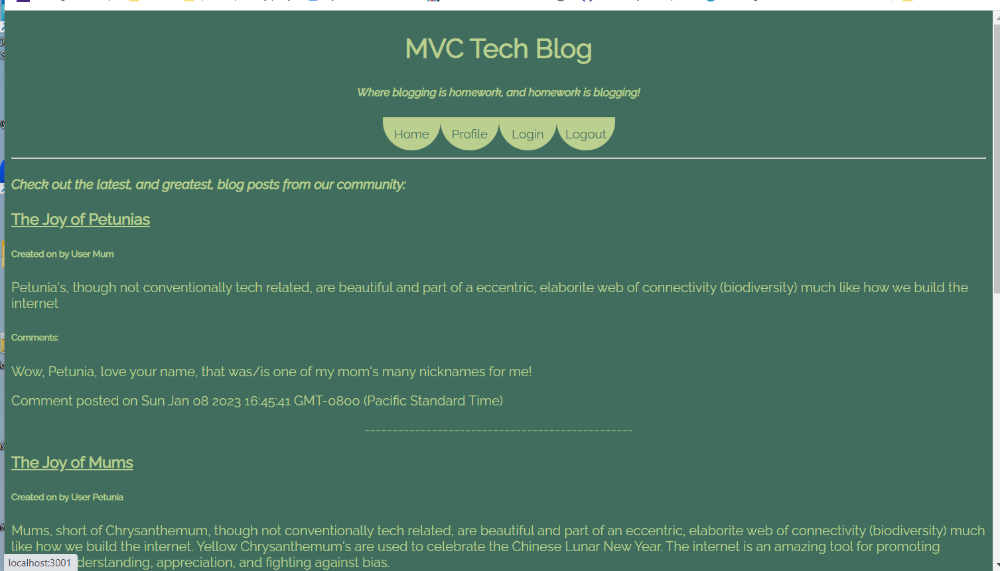
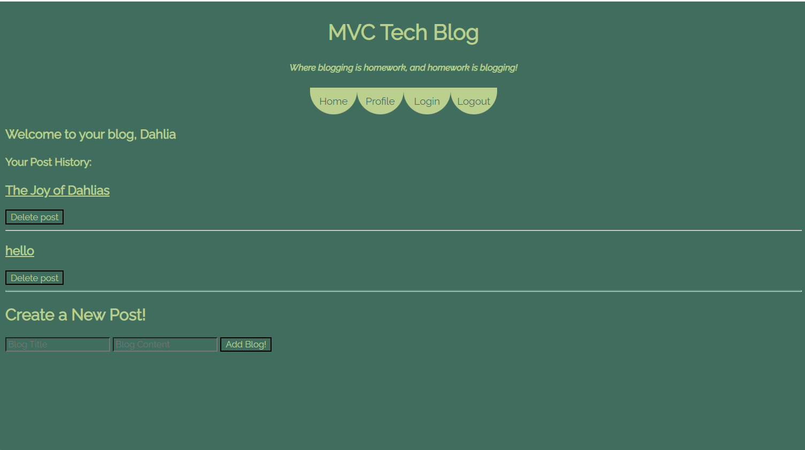
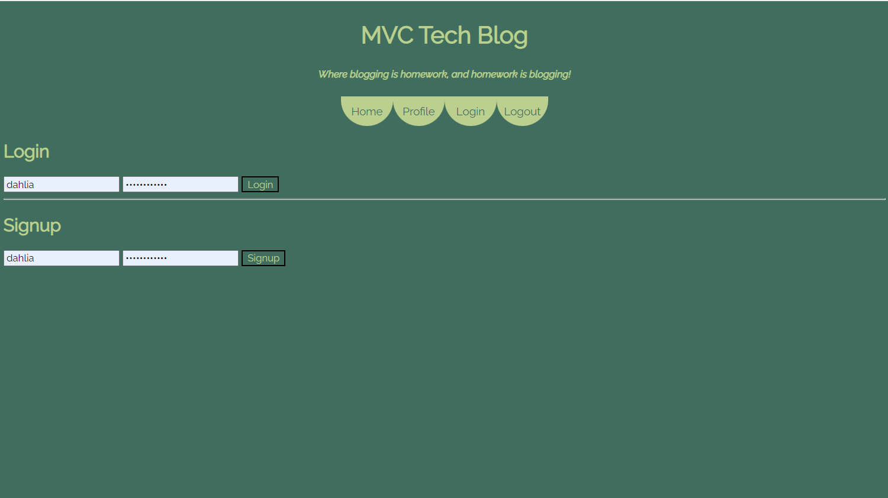
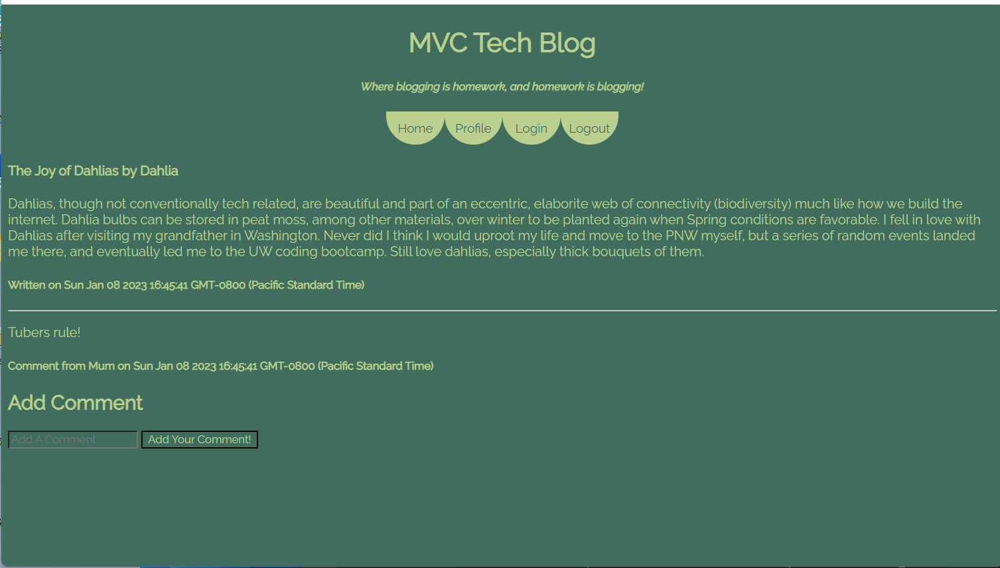

# MVC-tech-blog

## Description and Usage
This is a deployed web application using node.js, express, sql, and handlebars in the MVC (model, views, controller) style to create a Front-end blog application. 
Upon reaching the landing page a user will be greeted with all exisiting blog posts (theoretically tech related). At the top of the page, beneath the header, there is a nav bar. a user can login to an existing account, or create a new account, by clicking on the 'login' button. After logging in, they will be redirected to their personal profile, where they can view their personal blog posts. It is on this page that a user can create a new page. Each blog is linked to a unique associate page by clicking on the title. 
## Links
Deployed: https://pacific-dawn-24698.herokuapp.com/

GitHub Repository: https://github.com/D-Dursty/MVC-tech-blog

## Screenshots

## Credits
This site was built by Devon Durst using Handlebars, Express, Sql, and Node.js

## License
N/A